# AWS Image Resizer Pro
Improved version of previous project(aws-image-resizer):
[link to the basic version](https://github.com/kyrylobaliurawork-web/aws-image-resizer)

---

# Project Overview

The main goal of this project is to demonstrate:

- Serverless architecture with AWS
- Image processing with Python
- API-driven image resizing
- Low-cost infrastructure using serverless services
- DNS and CDN with AWS
- Basic DB level 
- Unlike the basic version, improve our understanding of the code
- Configure custom domain routing using Amazon Route 53

---

# Architecture

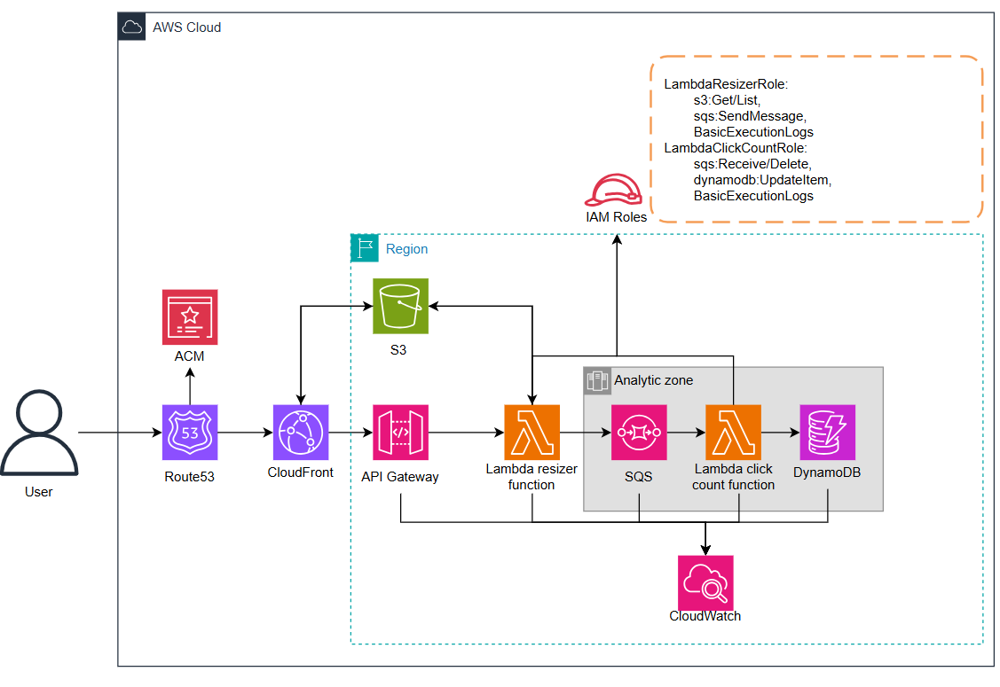

# Request Flow
  - User Request
      - A user sends a request via a custom domain.
  - DNS Routing
      - Amazon Route 53 resolves the domain and routes traffic to the CDN.
      - Configure custom domain.
  - Content Delivery
      - Amazon CloudFront acts as a CDN layer:
        - Serves cached images if available
        - Forwards uncached requests to the backend
  - API Gateway
        - Amazon API Gateway receives the request and triggers backend logic.
  - Lambda Image Resizer
      - AWS Lambda (Image Resizer function):
        - Fetches the original image from Amazon S3
        - Resizes the image using Python
        - Stores the processed image back to S3
        - Sends a message to the queue for analytics
  - Storage Layer
      - Amazon S3:
        - Stores both original and resized images
        - Acts as the origin for CloudFront
# Analytics Pipeline
  - Message Queue
      - Amazon SQS receives events about image processing
      - Click Count Processor
  - Another AWS Lambda function:
      - Processes messages from SQS
      - Updates usage statistics
  - Database
    - Amazon DynamoDB stores:
      - Image request counts
      - Analytics data
  - Monitoring
    - Amazon CloudWatch collects:
      - Logs
      - Metrics
      - System health data

# Security Layer
  - IAM Roles control permissions between services:
      Lambda can access S3, SQS, and DynamoDB
      Logging permissions via CloudWatch

## AWS Lambda Image Resizer (Python)

To make our application work we have to update python code
There are new python files which will be usefull in this case

## AWS Click Count (Python)

Now we need to create a new Lambda function for click count algorithm. We need to do the same actions like with Lambda Image Resizer function from previous part but here we don't have to add our pillow, because this function doesn't use external libraries. 

## AWS SQS
Now we need to create SQS queue for photo opens counting and to queue or requests if we're going to work with many people

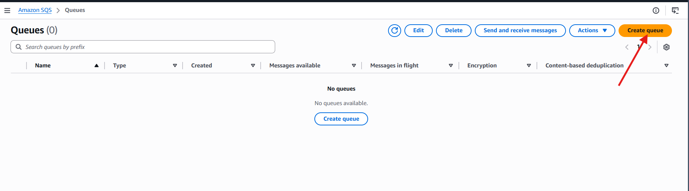

# With these parameters. 
  - We need to make visibility timeout > processing image time
  - To make less requests and save some money set Receive message wait time about 10-20
  - 2 days retention period will be more than enought for click counts and max size 256 KiB is the same
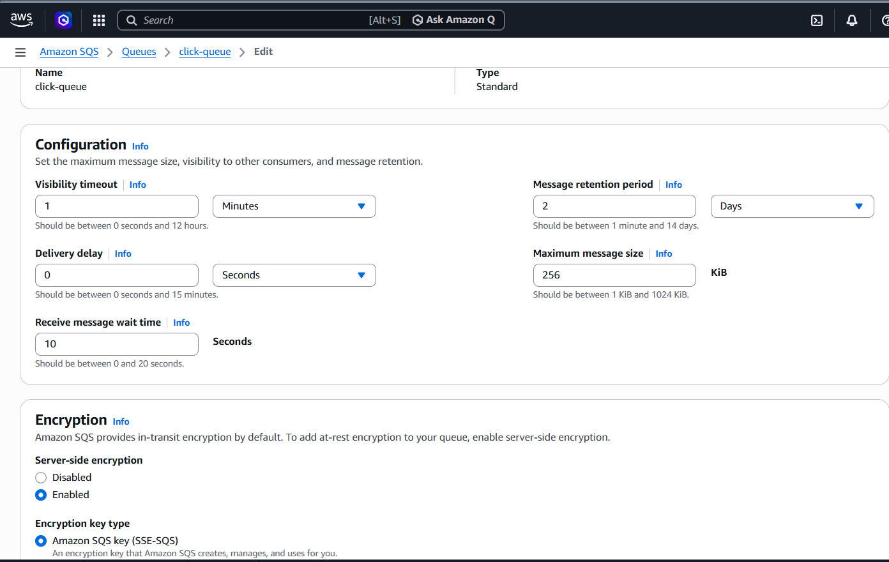

# Then copy the arn of sqs queue
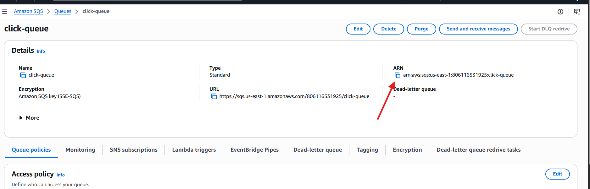

# And add the Dead Letter queue, so that after 3 unsuccessful attempts the message goes to the DLQ
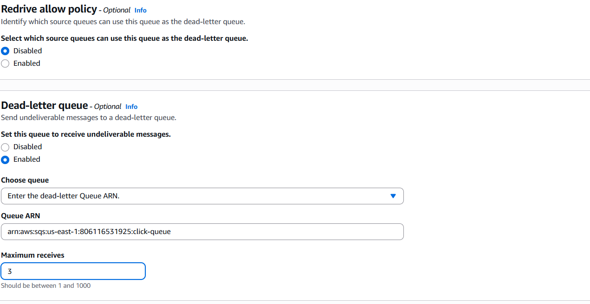 

## API Gateway
In previos part we've already created API and connect it ot the lambda function(Image Resizer function)
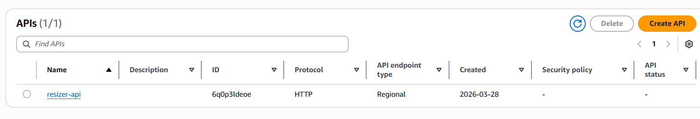
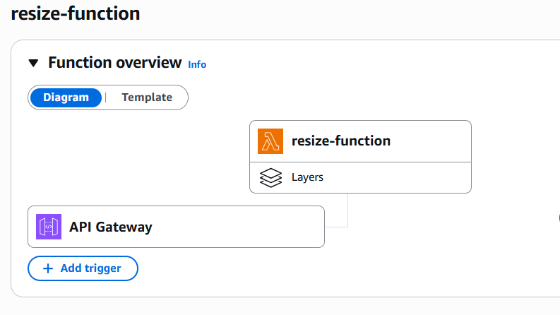

## IAM Roles
So now we have to update our IAM roles for both Lambda function:
 - for Image Resizer function we have to add sqs:SendMessage to send message to our SQS queue when uesr make request to resize his photo.So now it will look like this(like always we have to comply the least privilege principle):
```json
{
    "Version": "2012-10-17",
    "Statement": [
        {
            "Effect": "Allow",
            "Action": "logs:CreateLogGroup",
            "Resource": "arn:aws:logs:us-east-1:806116531925:*"
        },
        {
            "Effect": "Allow",
            "Action": [
                "logs:CreateLogStream",
                "logs:PutLogEvents"
            ],
            "Resource": [
                "arn:aws:logs:us-east-1:806116531925:log-group:/aws/lambda/resize-function:*"
            ]
        },
        {
            "Effect": "Allow",
            "Action": "s3:GetObject",
            "Resource": "arn:aws:s3:::images-resizer-bucket-own/*"
        },
        {
            "Effect": "Allow",
            "Action": "sqs:SendMessage",
            "Resource": "arn:aws:sqs:us-east-1:806116531925:click-queue"
        }
    ]
}
```
And for Click Count function we have to add some access for sqs actions because without it we could not even add the SQS trigger to our Lambda function:
```json
{
    "Version": "2012-10-17",
    "Statement": [
        {
            "Effect": "Allow",
            "Action": "logs:CreateLogGroup",
            "Resource": "arn:aws:logs:us-east-1:806116531925:*"
        },
        {
            "Effect": "Allow",
            "Action": [
                "logs:CreateLogStream",
                "logs:PutLogEvents"
            ],
            "Resource": [
                "arn:aws:logs:us-east-1:806116531925:log-group:/aws/lambda/resize-function:*"
            ]
        },
        {
            "Effect": "Allow",
            "Action": "s3:GetObject",
            "Resource": "arn:aws:s3:::images-resizer-bucket-own/*"
        },
        {
            "Effect": "Allow",
            "Action": "sqs:SendMessage",
            "Resource": "arn:aws:sqs:us-east-1:806116531925:click-queue"
        }
    ]
}
```

## SQS trigger 
Add the sqs trigger to the Click Count function, do it the same way as with API Gateway trigger
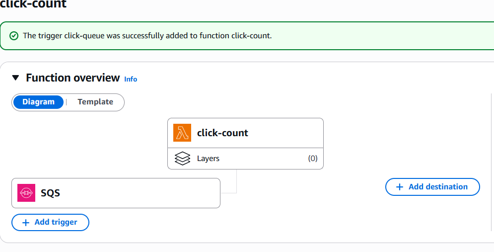

## DynamoDB 
So now we have to create DynamoDB table to store our counted clicks.
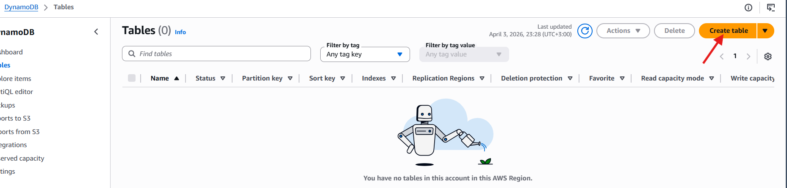

Table name and partion key must be the same as in our/your python code
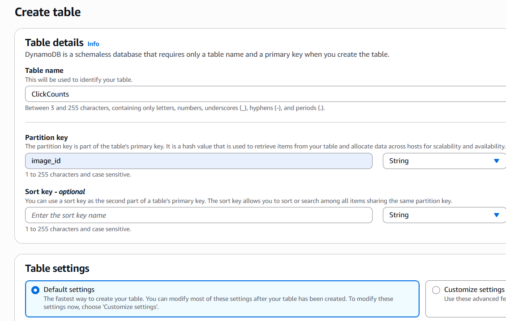

# Also we have to add some environment variables to secure our application
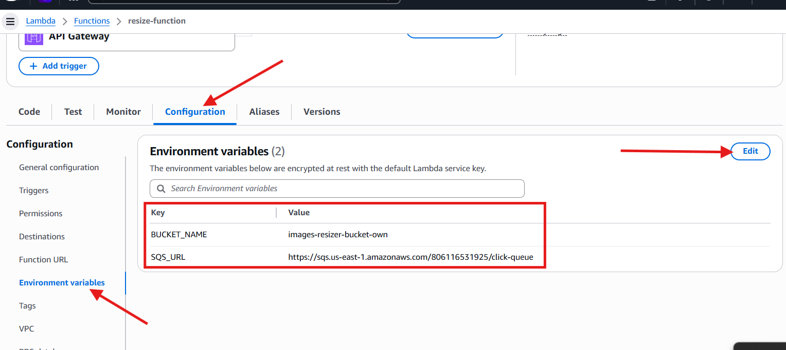
