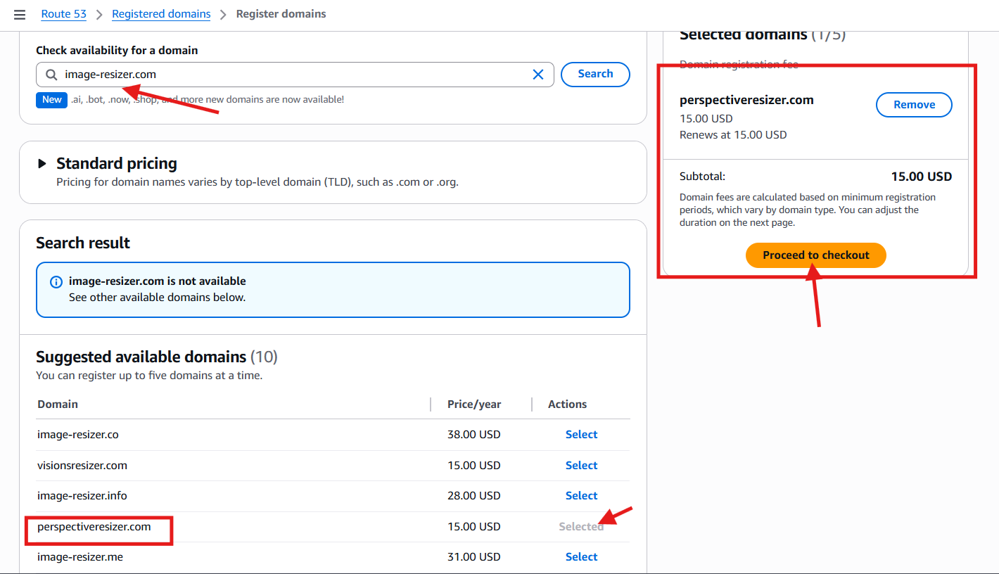
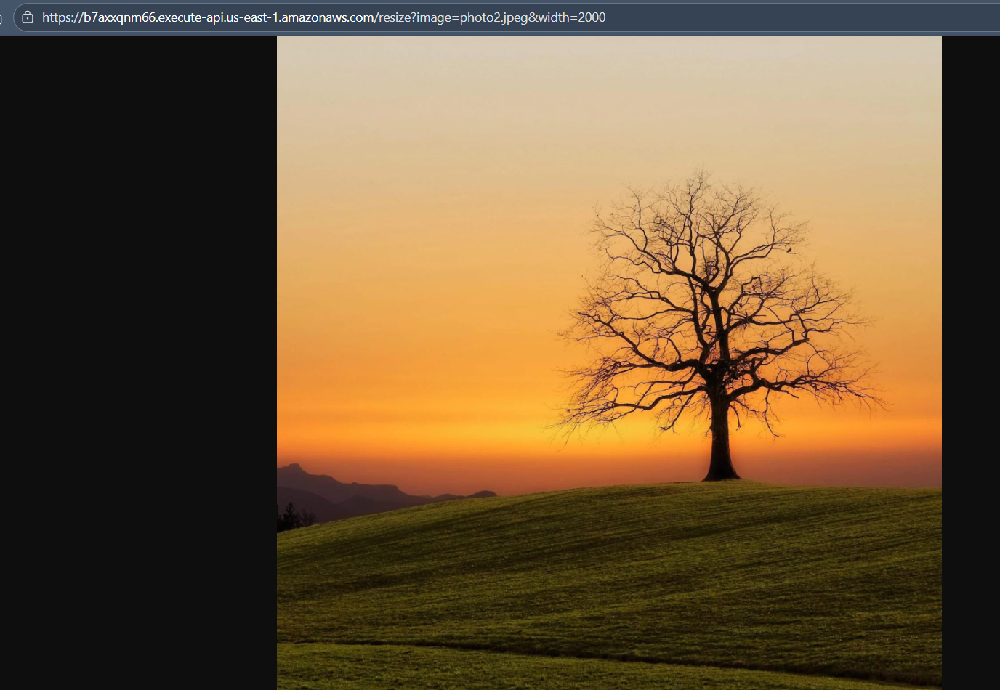
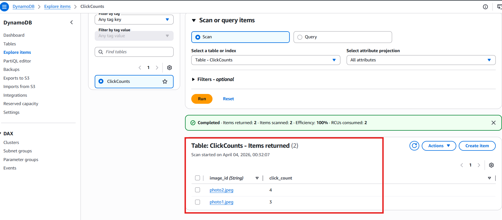

# AWS Image Resizer Pro
Improved version of previous project(aws-image-resizer):
[link to the basic version](https://github.com/kyrylobaliurawork-web/aws-image-resizer)

---

# Project Overview

The main goal of this project is to demonstrate:

- Serverless architecture with AWS
- Image processing with Python
- API-driven image resizing
- Low-cost infrastructure using serverless services
- DNS and CDN with AWS
- Basic DB level 
- Unlike the basic version, improve our understanding of the code
- Configure custom domain routing using Amazon Route 53

---

# Architecture


# Request Flow
  - User Request
      - A user sends a request via a custom domain.
  - DNS Routing
      - Amazon Route 53 resolves the domain and routes traffic to the CDN.
      - Configure custom domain.
  - Content Delivery
      - Amazon CloudFront acts as a CDN layer:
        - Serves cached images if available
        - Forwards uncached requests to the backend
  - API Gateway
        - Amazon API Gateway receives the request and triggers backend logic.
  - Lambda Image Resizer
      - AWS Lambda (Image Resizer function):
        - Fetches the original image from Amazon S3
        - Resizes the image using Python
        - Stores the processed image back to S3
        - Sends a message to the queue for analytics
  - Storage Layer
      - Amazon S3:
        - Stores both original and resized images
        - Acts as the origin for CloudFront
# Analytics Pipeline
  - Message Queue
      - Amazon SQS receives events about image processing
      - Click Count Processor
  - Another AWS Lambda function:
      - Processes messages from SQS
      - Updates usage statistics
  - Database
    - Amazon DynamoDB stores:
      - Image request counts
      - Analytics data
  - Monitoring
    - Amazon CloudWatch collects:
      - Logs
      - Metrics
      - System health data

# Security Layer
  - IAM Roles control permissions between services:
      Lambda can access S3, SQS, and DynamoDB
      Logging permissions via CloudWatch

## AWS Lambda Image Resizer (Python)

To make our application work, we need to update the Python code.  
New Python files have been added and will be useful for implementing the image resizing functionality.

---

## AWS Click Count (Python)

Now we need to create a new Lambda function for the click count algorithm.  
We should follow the same steps as for the Image Resizer Lambda function from the previous section.  

However, in this case, we do not need to include external libraries like Pillow, since this function does not require them.

---

## AWS SQS

Next, we create an SQS queue to handle photo open events and to queue requests when the system is under load.


### Configuration

- Visibility timeout should be greater than the image processing time  
- Set **Receive message wait time** to 10–20 seconds to enable long polling and reduce costs  
- A **2-day retention period** is sufficient for click tracking  
- Set **maximum message size** to 256 KiB  


---

### Dead Letter Queue (DLQ)

Copy the ARN of your SQS queue:


Then configure a Dead Letter Queue (DLQ), so that after 3 failed processing attempts, the message is moved to the DLQ.


---

## API Gateway

In the previous section, we already created an API and connected it to the Image Resizer Lambda function.

  


---

## IAM Roles

Now we need to update IAM roles for both Lambda functions.

### Image Resizer Function

We need to:
- Send messages to SQS → `sqs:SendMessage`  
- Check if an image exists in S3 → `s3:ListBucket`  

Following the **principle of least privilege**, the policy looks like this:

```json
{
	"Version": "2012-10-17",
	"Statement": [
		{
			"Effect": "Allow",
			"Action": "logs:CreateLogGroup",
			"Resource": "arn:aws:logs:us-east-1:806116531925:*"
		},
		{
			"Effect": "Allow",
			"Action": [
				"logs:CreateLogStream",
				"logs:PutLogEvents"
			],
			"Resource": [
				"arn:aws:logs:us-east-1:806116531925:log-group:/aws/lambda/resize-function:*"
			]
		},
		{
			"Effect": "Allow",
			"Action": [
				"s3:GetObject",
				"s3:ListBucket"
			],
			"Resource": [
				"arn:aws:s3:::images-resizer-bucket-own",
				"arn:aws:s3:::images-resizer-bucket-own/*"
			]
		},
		{
			"Effect": "Allow",
			"Action": "sqs:SendMessage",
			"Resource": "arn:aws:sqs:us-east-1:806116531925:click-queue"
		}
	]
}
```
## Click Count Function

This function requires access to SQS in order to be triggered and process messages.

### IAM Policy

```json
{
	"Version": "2012-10-17",
	"Statement": [
		{
			"Effect": "Allow",
			"Action": "logs:CreateLogGroup",
			"Resource": "arn:aws:logs:us-east-1:806116531925:*"
		},
		{
			"Effect": "Allow",
			"Action": [
				"logs:CreateLogStream",
				"logs:PutLogEvents"
			],
			"Resource": [
				"arn:aws:logs:us-east-1:806116531925:log-group:/aws/lambda/click-count:*"
			]
		},
		{
			"Effect": "Allow",
			"Action": [
				"sqs:ReceiveMessage",
				"sqs:DeleteMessage",
				"sqs:GetQueueAttributes"
			],
			"Resource": "arn:aws:sqs:us-east-1:806116531925:click-queue"
		},
		{
			"Effect": "Allow",
			"Action": [
				"dynamodb:UpdateItem"
			],
			"Resource": "arn:aws:dynamodb:us-east-1:806116531925:table/ClickCounts"
		}
	]
}
```

## SQS Trigger

Add the SQS trigger to the Click Count Lambda function, just like you did with the API Gateway trigger.


---

## DynamoDB

Create a DynamoDB table to store click counts.


Make sure the **table name** and **partition key** match your Python code configuration.


---

## Environment Variables

Add environment variables to configure and secure your Lambda functions.


---

## CloudFront

_To be implemented._  
CloudFront can be used to cache and deliver resized images efficiently via CDN.

---

## Route 53

# Using a Custom Domain with Your API

This section explains how to buy a domain via Route 53 and connect it to your API Gateway.

---

# 1. Buy a Domain

1. Go to **Route 53 → Domains → Register Domain**.  
2. Choose your domain name (e.g., `myportfolio.com`) and follow the purchase process.  



> **Note:** Domain registration is annual. You will be billed every year unless you cancel or transfer the domain.

---

# 2. Create a Hosted Zone

1. Navigate to **Route 53 → Hosted Zones → Create Hosted Zone**.  
2. Enter your domain name and select the type **Public Hosted Zone**.  
3. Optionally, add a description or tags for organization.  

---

# 3. Connect Domain to API Gateway

1. In **API Gateway**, create a **Custom Domain Name**.  
2. Request or select an SSL certificate via **AWS Certificate Manager (ACM)**.  
3. API Gateway will generate an **endpoint target (CloudFront distribution)**.  
4. Go back to your **Route 53 hosted zone**, and add an **A/ALIAS record** pointing to the CloudFront distribution.  

> After this, requests to `https://myportfolio.com` (or a subdomain like `api.myportfolio.com`) will route to your Lambda function.
> 
---

## Result

After everything is set up:

- You can send a request to resize an image from your S3 bucket.
- The image will be processed by the Lambda function.
- Click counts will be updated in DynamoDB.

  


---

## Further Actions

- Build a full-featured frontend website (e.g., using React or Next.js) to provide a user interface for uploading and viewing images.  
- Implement image upload functionality from the client-side directly to an S3 bucket (via pre-signed URLs or backend API).  
- Connect the frontend with the backend API to trigger image processing (resize) requests.  
- Automatically send uploaded images to the processing pipeline (SQS → Lambda → S3).  
- Display processed (resized) images back in the UI after completion.  
- Add authentication (e.g., JWT or Cognito) to secure API endpoints.  
- Implement rate limiting and validation to prevent abuse.  
- Improve error handling and logging across the system.  
- Optimize performance (caching resized images, CDN via CloudFront).  
- Prepare the project for production deployment (CI/CD, environment configs, monitoring).  
